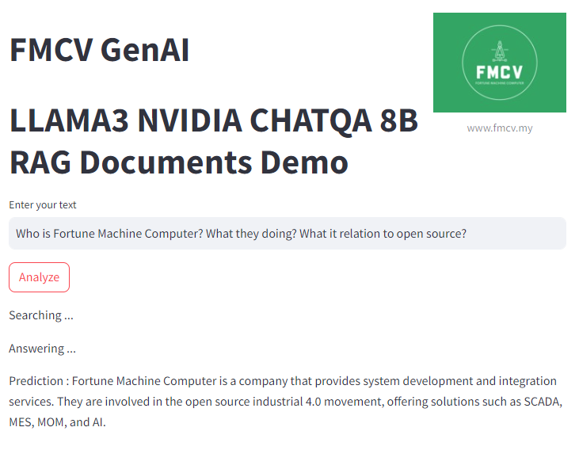

# RAGGenAI
FMCV GenAI Llama3 8B Nvidia ChatQA RAG finetuned


# PDF Knownledge base
put some pdf according your computer RAM size in "Docs" folder, then it saved text into list in "RAG_dict.json" for the first time\
you can start query to your document and
retrieval engine search the related chunk of text and rank it\
take the first few chuck automatically as context 4k token size\
then the LLM reply with answer

# Instruction
firstly setup you python environment</br>
```
pip install pytorch transformers streamlit pypdf2
```
add anothers package didn't mention here if missed document it </br>
```
streamlit run example_RAG.py
```
